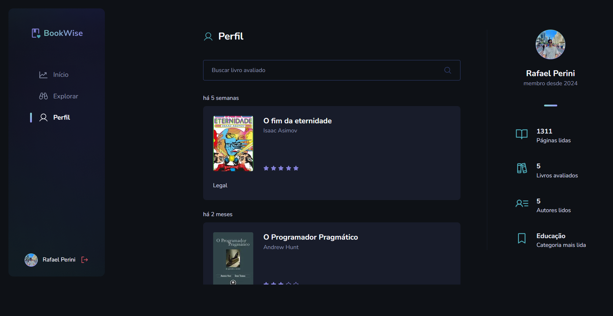

# Book Wise

## Descrição

Book Wise é uma plataforma web que conecta leitores, permitindo que eles descubram novos livros através de recomendações e avaliações de outros usuários. 

## Funcionalidades

* **Autenticação:** Login com Google ou GitHub para interagir plenamente com a plataforma, incluindo a criação de avaliações e a visualização de estatísticas pessoais.

* **Feed:** Um feed com as avaliações mais recentes e os livros com melhores ratings.

* **Avaliações:** Os usuários podem avaliar livros que já leram, deixando feedbacks detalhados.

* **Explorar:** Um catálogo completo de livros, com busca por título e filtros por categoria. Ao clicar em um livro, o usuário pode ver detalhes e as avaliações de outros leitores.

* **Perfil do Usuário:** Cada usuário possui um perfil personalizado, onde pode ver suas avaliações, estatísticas de leitura (páginas lidas, livros avaliados, autores favoritos) e muito mais.





## Tecnologias

* **Frontend:** Next.js, React, TypeScript
* **Backend:** Next.js (com backend simplificado)
* **Bibliotecas:**
  * **@prisma/client:** ORM para interagir com o banco de dados
  * **@radix-ui/react-dialog:** Biblioteca de componentes para criação de diálogos
  * **@stitches/react:** Framework CSS-in-JS para estilização
  * **@tanstack/react-query:** Biblioteca para gerenciamento de estado e fetching de dados
  * **axios:** Biblioteca para fazer requisições HTTP
  * **next-auth:** Biblioteca para autenticação com diversas provedoras (Google, GitHub)
  * **react:** Biblioteca JavaScript para construção de interfaces de usuário
  * **zod:** Biblioteca para validação de dados


## Como executar o projeto

1. **Clone o repositório:**
  ```bash
    git clone https://github.com/faelperini/07-book-wise
  ```

2. **Instale as dependências:**
  ```bash
    cd 07-book-wise
    npm install
  ```

3. **Popule o banco de dados:**
  ```bash
    npx prisma db seed
  ```

3. **Inicie o desenvolvimento:**
  ```bash
    npx prisma studio
    npm run dev
  ```

O aplicativo será iniciado em http://localhost:3000/login

